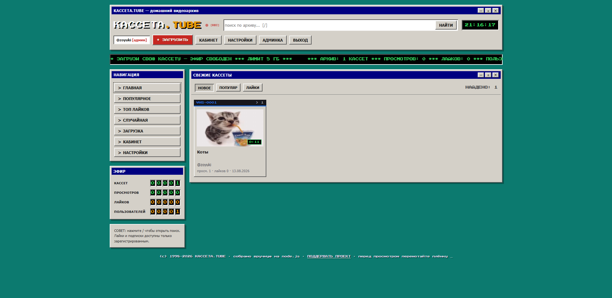

# KASSETA.TUBE

<figure>
  
  <figcaption>извините за качество изображения. это не сайт, это мой пк виноват</figcaption>
</figure>

Самодельный ретро-видеохостинг в стиле Win95 / Youtube 2000-х.

### DEMO: [kasseta.tube](https://kasseta.serveousercontent.com) (Видео больше 25мб не грузит. Ограничение serveo-туннелей.)

# Установка

<details>
   <summary>Windows</summary>

   1. Установите [git](https://git-scm.com/) и [node.js](https://nodejs.org/en/download)
   2. ```
      git clone https://github.com/zoyuki/kasseta
      cd kasseta
      npm i
      ```
   3. Запустите [start.bat](./start.bat)
</details>

<details>
   <summary>Linux</summary>

   1. Установите git и node.js
   2. ```
      git clone https://github.com/zoyuki/kasseta
      cd kasseta
      npm i
      ```
   3. Запустите [start.sh](./start.sh)
</details>

**Обязательно создайте свой аккаунт, емае! Сколько ждать? Кто первый, тот получает админку!**

# Конфиг

Все настройки берутся из файла **`.env`** в корне проекта. Скопируйте `.env.example` в `.env` и заполните свои значения — сценарии `start.bat`/`start.sh` ничего не настраивают, они просто запускают сервер (с автоперезапуском при падении).

`.env` не коммитится в git — там живут креды SMTP и номер карты, не светите их в bat/sh. Из `.env` подхватятся:

- `PORT` — порт (по умолч. 3000)
- `MAX_MB` — лимит видеофайла в МБ (по умолч. 5000)
- `SMTP_HOST`, `SMTP_PORT`, `SMTP_USER`, `SMTP_PASS` — почта для кодов подтверждения
- `DONATE_CARD`, `DONATE_NAME` — страница «Поддержать проект»

Если переменные не заданы, сервер работает с встроенными значениями по умолчанию (почта и реквизиты тогда выключены, коды регистрации показываются в консоли). При старте сервер сам проверит подключение к SMTP и напишет в консоль, всё ли ок.

# Что тут?

Не особо много привлекательного, просто обычный видеохостинг.

- Есть smtp для mail.ru/других smtp
- Уникальные ники
- Регистрация/вход
- Публикация своих видео (естественно)
- Админ-панель
- Даже нет базы данных. Все в json-файле
- Аватарки, подписки и все для пользователей

## Поддержка

На сайте есть страница /#/support. По умолчанию там стоит мой номер карты. Буду рад, если переведете копеечку. Мечтаю запустить этот проект на хостинге.

##### сделано с любовью, cho
